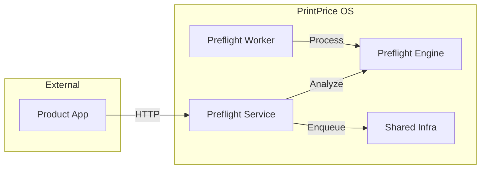

# PrintPrice OS — Preflight Service (`ppos-preflight-service`)

## 1. Repository Role
The `ppos-preflight-service` is the **HTTP Orchestration Layer** for the PrintPrice OS Preflight system. It exposes a RESTful API that allows product applications to request PDF analysis and automatic fixes without needing direct access to the underlying engine logic.

## 2. Architecture Position
It acts as the primary gateway for all preflight operations. It sits between the Product Application and the internal OS services and engines.



## 3. Responsibilities
- **API Surface**: Exposing `/preflight/analyze` and `/preflight/autofix` endpoints.
- **Request Validation**: Sanitizing incoming PDF assets and metadata.
- **Orchestration**: Deciding whether to process a request synchronously via the Engine or asynchronously via a Worker delegation.
- **File Management**: Temporary storage and lifecycle management of assets during processing.

## 4. API Response Examples

### Analyze Endpoint (`/preflight/analyze`)
**Request**: `POST /preflight/analyze` (multipart/form-data)
**Response**:
```json
{
  "ok": true,
  "data": {
    "risk_score": 0.15,
    "findings": [
      {
        "type": "BLEED_MISSING",
        "severity": "warning",
        "message": "Asset is missing standard 3mm bleed."
      },
      {
        "type": "LOW_RESOLUTION_IMAGE",
        "severity": "critical",
        "message": "Image 'hero.jpg' is below 150 DPI."
      }
    ],
    "stats": {
       "pages": 1,
       "colorspace": "CMYK"
    }
  }
}
```

### Autofix Endpoint (`/preflight/autofix`)
**Request**: `POST /preflight/autofix` (multipart/form-data)
**Response**:
```json
{
  "ok": true,
  "job_id": "job_1773625224025",
  "status": "QUEUED"
}
```

## 5. Dependency Relationships
- **Internal**: Consumes `ppos-preflight-engine` for core analysis.
- **Foundation**: Consumes `ppos-shared-infra` for queuing and governance.
- **Client**: Served to the `PrintPricePro_Preflight` product application.

## 6. Local Development

### Installation
```bash
npm install
```

### Running Locally
```bash
# Start the Fastify server
node server.js
```
The service will start on port `3000` (default).

## 7. Environment Variables
| Variable | Description | Default |
| :--- | :--- | :--- |
| `PORT` | Listening port for the service | `3000` |
| `PPOS_QUEUE_NAME` | Target queue for async jobs | `preflight_async_queue` |
| `PPOS_SHARED_INFRA_PATH` | Path to shared infra (if local) | `../ppos-shared-infra` |

## 8. Version Baseline
**Current Version**: `v1.9.0` (Federated Health & Decoupling Pass)

---
© 2026 PrintPrice. Distributed Execution Infrastructure.